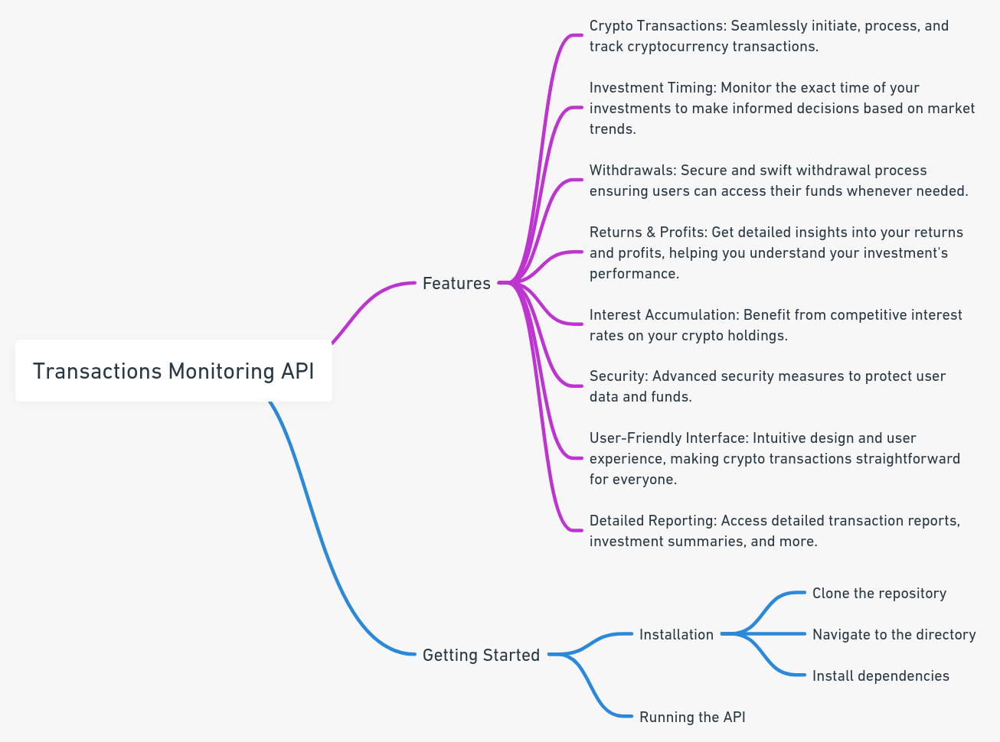

# Transactions Monitoring API

The Transactions Monitoring API is a robust solution designed to facilitate and monitor cryptocurrency transactions. With a focus on user experience and security, this API provides a comprehensive suite of features tailored for both beginners and seasoned crypto enthusiasts.

## Features

- **Crypto Transactions**: Seamlessly initiate, process, and track cryptocurrency transactions.
  
- **Investment Timing**: Monitor the exact time of your investments to make informed decisions based on market trends.
  
- **Withdrawals**: Secure and swift withdrawal process ensuring users can access their funds whenever needed.
  
- **Returns & Profits**: Get detailed insights into your returns and profits, helping you understand your investment's performance.
  
- **Interest Accumulation**: Benefit from competitive interest rates on your crypto holdings.
  
- **Security**: Advanced security measures to protect user data and funds.
  
- **User-Friendly Interface**: Intuitive design and user experience, making crypto transactions straightforward for everyone.
  
- **Detailed Reporting**: Access detailed transaction reports, investment summaries, and more.

## Getting Started

